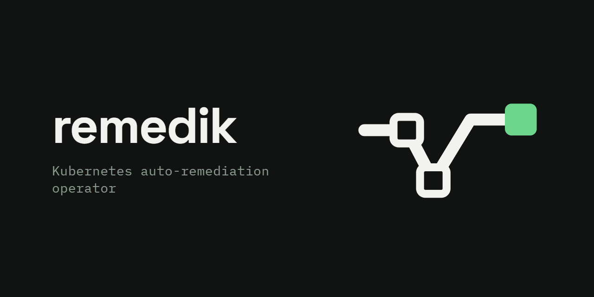
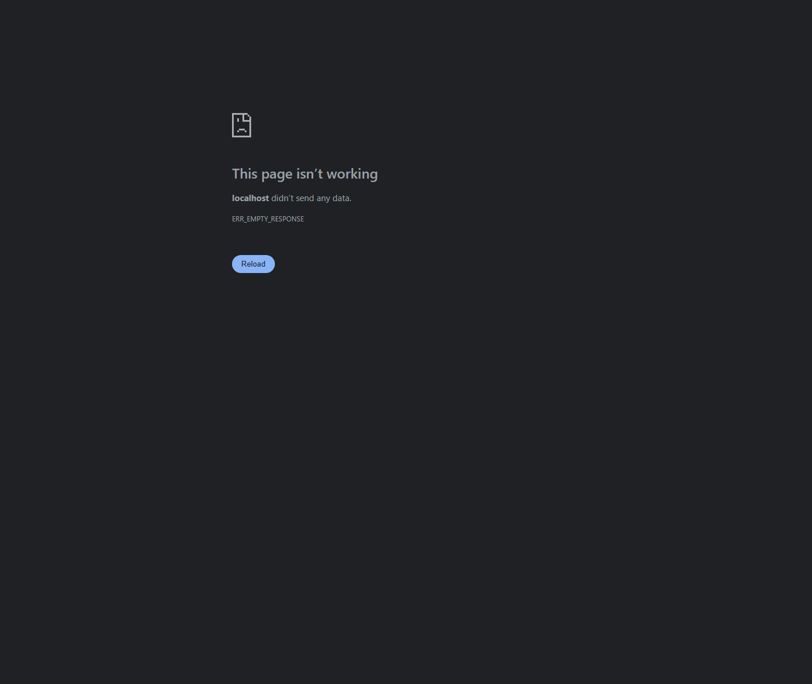
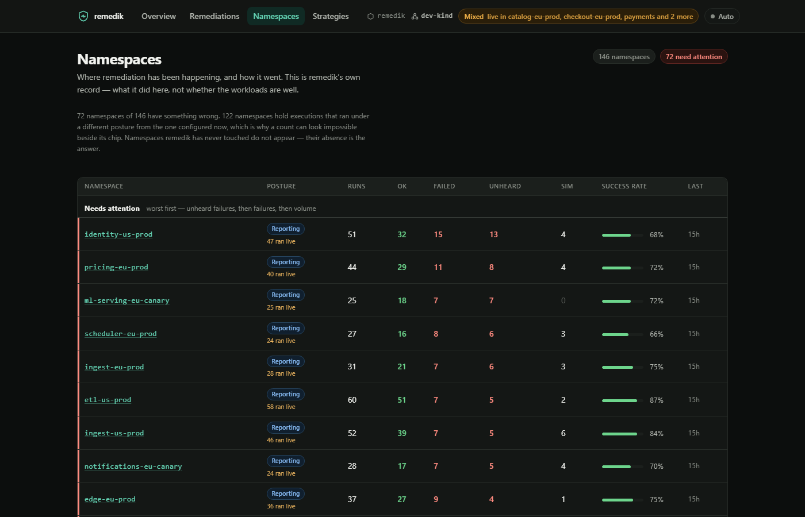
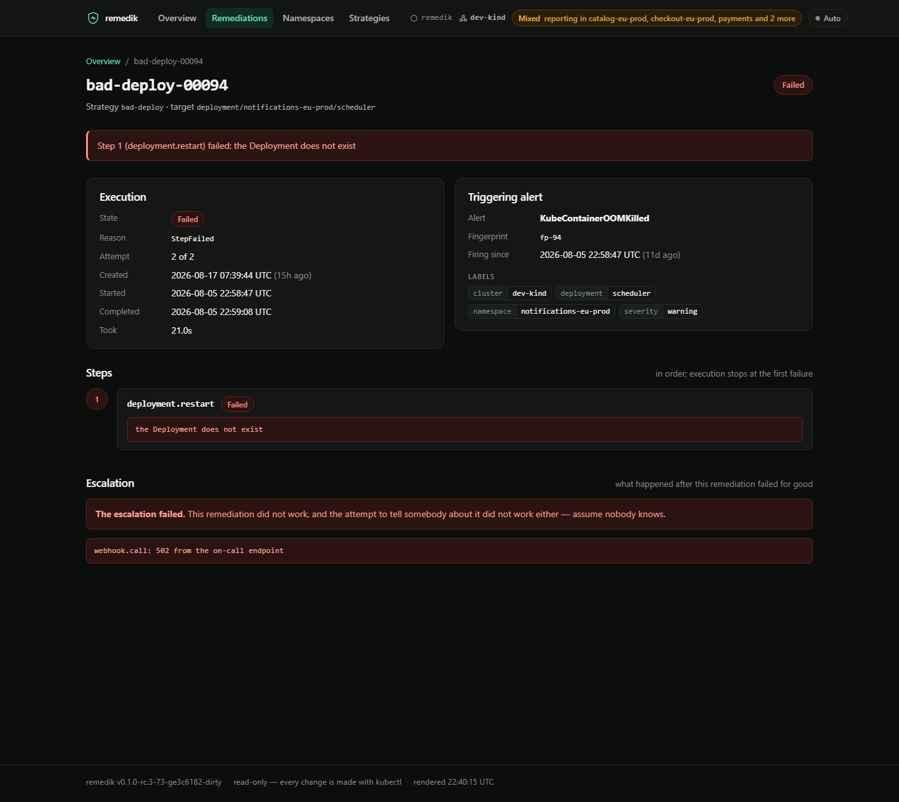

<p align="center">
  
</p>

# remedik

> Predictably boring auto-remediation for Kubernetes alerts.

[](https://github.com/remedik/remedik/actions/workflows/ci.yml)
[](https://scorecard.dev/viewer/?uri=github.com/remedik/remedik)
[](https://pkg.go.dev/github.com/remedik/remedik)
[](LICENSE)

**It is 03:00 and `payments-api` is crash-looping again.** Somebody is
paged, opens a runbook, reads three lines, types `kubectl rollout restart`,
and goes back to bed. The same three lines, the fortieth time this quarter.

That work is mechanical, and mechanical work is exactly what should not need
a person at 03:00. What has kept it manual is not difficulty — it is that
handing a robot write access to production is a decision nobody wants to
sign off on.

remedik is built for that signature. It turns Alertmanager alerts into
remediation you can audit, bound and switch off, and it is deliberately
boring: strategies are custom resources you keep in git, every execution is
recorded as a `Remediation` object in the cluster, guards bound the blast
radius before anything runs, and an LLM never sits in the execution path.

### Why you can actually run it

|  |  |
| --- | --- |
| **It does nothing by default** | Dry-run is the install default, and it is structural rather than a flag — actions implement `Plan` and `Execute` as separate methods, so a simulated run never reaches the mutating one. Read the reports for a week before changing anything. |
| **Adoption is not all-or-nothing** | Posture is per namespace. Act in `staging`, report only in `prod`, one install. |
| **Permissions follow features** | The chart grants a permission only because a named action needs it. Enable nothing, and remedik can read. `make verify` fails if that stops being true. |
| **Every action explains itself** | Each `Remediation` records the plan, the `kubectl` a human would have typed, what changed, and whether it worked — so an incident review reads the record, not the logs. |
| **When it fails, somebody is told** | `onFailure.steps` is a second plan. If that fails too, the record says so, because "we tried to tell you and could not" is the thing you need to find later. |
| **The supply chain is checkable** | Multi-arch images signed with cosign keyless, an SBOM attested to the image, every GitHub Action pinned to a commit SHA, and `govulncheck` in the gate. |

Nothing is published yet: the tags that exist are release candidates and
their packages are private until this repository is. `v0.1.0` is the first
one meant to be installed. Until then, `make dev-up && make dev-deploy`
builds and runs it from a checkout.

```console
# Verify a release before you trust it — no key required.
cosign verify ghcr.io/remedik/remedik:v0.1.0 \
  --certificate-identity-regexp '^https://github.com/remedik/remedik/' \
  --certificate-oidc-issuer https://token.actions.githubusercontent.com
```

### What it looks like

The dashboard is off by default and read-only by construction — built from a
`client.Reader`, and answering anything but GET and HEAD with 405 before
routing. It answers the two questions that are painful through kubectl:
*is anything wrong right now*, and *what did this one actually do*.

<p align="center">
  
</p>

With fifty namespaces, "what happened" is the wrong question. `/namespaces`
answers where it is going badly, putting the failures nobody was told about
at the top:

<p align="center">
  
</p>

Every failure has a page that explains itself — the plan, the error, and
whether anybody was told:

<p align="center">
  
</p>

More in [docs/screenshots](docs/screenshots), regenerated by
[`hack/screenshots.sh`](hack/screenshots.sh) from a real cluster.

**Status: alpha.** The core loop works end to end — alert in, guarded
remediation out, audit trail in the cluster — covered by unit tests and an
end-to-end test that builds a throwaway cluster and runs the whole loop
against real objects. The API may still change; every change is specified in
[`openspec/`](openspec/) before it lands.

## What it does today

```yaml
apiVersion: remedik.dev/v1alpha1
kind: RemediationStrategy
metadata:
  name: pod-crashloop
spec:
  trigger:
    match:
      alertname: KubePodCrashLooping
  guards:
    cooldown: 15m        # do not restart the same workload again this soon
    maxPerHour: 4        # an alert storm cannot amplify into an outage
  steps:
    - action: deployment.restart
  onFailure:
    retries: 1
    steps:                        # and if that still does not work, page somebody
      - action: webhook.call
        with:
          url: https://events.pagerduty.com/v2/enqueue
          secretRef: pagerduty-routing-key
          secretKey: key
```

```console
$ kubectl get remediations -n remedik
NAME                  STRATEGY        TARGET                    STATE       AGE
pod-crashloop-x7k2q   pod-crashloop   deployment/payments/api   Succeeded   2m
pod-crashloop-b91mm   pod-crashloop   deployment/checkout/web   Simulated   1h
```

**Fourteen actions ship today**, each a separate permission the chart grants
only when you enable it, and only `deployment.restart` on by default:

| | Action | What it does |
| --- | --- | --- |
| **Workloads** | `deployment.restart` | Rolling restart of a Deployment |
| | `workload.restart` | The same, for StatefulSets and DaemonSets too |
| | `pod.delete` | Evicts one pod **through the Eviction API**, so a PodDisruptionBudget can refuse |
| | `job.delete` | Deletes a failed Job so its CronJob makes a clean run |
| **Capacity** | `deployment.rollback` | Puts the previous revision back — refuses under Argo CD or Flux |
| | `deployment.scale` | Sets or increases replicas — refuses when an HPA owns the workload |
| | `hpa.scale` | Raises an autoscaler's ceiling; never lowers it |
| **Nodes** | `node.cordon` / `node.uncordon` | Stop and resume scheduling. Reversible, moves nothing |
| | `node.drain` | Cordon, then evict everything, honouring disruption budgets |
| | `pvc.expand` | Grows a volume — only where the StorageClass allows it |
| **Anything else** | `webhook.call` | POSTs the incident to your pipeline |
| | `job.run` / `script.run` | Runs your container or your runbook script as a Job |

Several of those descriptions say "refuses", and that is the interesting
part. Deleting a pod ignores disruption budgets entirely; eviction is the
only call that checks them, so remedik holds `create` on `pods/eviction` and
never `delete` on `pods` — it *cannot* force a pod out. A rollback in a
GitOps cluster would be reverted within minutes, so it refuses rather than
recording a success while the outage continues. A volume whose StorageClass
forbids expansion accepts the patch and does nothing, so remedik checks
first. And a remediation Job runs as a ServiceAccount you name, never
remedik's own, which is refused.

**When remediation does not work, somebody gets told.** `onFailure.steps` is
a second plan that runs once the retries are spent, so the loop closes:

```
alert --> remedik --> remediate --> it worked, done
                              \--> it did not --> page whoever is on call
```

Escalating is not a notification setting — it is made of the same actions,
under the same RBAC, in the same audit trail. It never turns a failure into
a success, it is never retried during an incident, and it runs during a dry
run too — the one exception in remedik, so a trial proves the path before
anybody needs it. `remedik_escalations_total{outcome="Failed"}` is its own
alertable signal: a remediation failed and nobody was told.

**Some things should wait for a person, and remedik will.** A strategy can ask
before it acts, per strategy — a node drain is not a pod restart:

```yaml
execution:
  mode: approval          # auto (default), approval, or manual
  approvalTimeout: 30m
```

The remediation then sits in `AwaitingApproval` and does nothing — nothing is
resolved, nothing is planned — until somebody decides:

```bash
kubectl -n remedik patch remediation drain-safely-x7k2q --type merge \
  -p '{"spec":{"approval":{"decision":"approve","by":"dana"}}}'
```

A patch, not a bot: attributable in your cluster's audit log, and usable from a
terminal, a runbook, a GitOps commit or a chat integration you write. It runs
against the cluster as it is when you approve, not as it was when the alert
fired. And **silence escalates** — no decision within `approvalTimeout` and the
alert reaches on-call the ordinary way, because a gate that quietly drops what
nobody looked at is worse than no gate.

**And one command stops everything, with no restart:**

```bash
kubectl -n remedik patch configmap remedik-pause --type merge \
  -p '{"data":{"paused":"true","reason":"network incident"}}'
```

Every replica is dry-run within seconds. It does not go quiet: records keep
appearing, marked `Simulated` and labelled with your reason, so you can see what
was suppressed rather than guess. remedik's RBAC on that ConfigMap is read-only
on that one name — **it cannot un-pause itself**, because a switch the tool can
flip is not a switch.

**Posture is per namespace, so adoption is not all-or-nothing.** `dryRun` is
the default; `namespacePosture` overrides it for the namespaces that have
earned it, in one install:

```yaml
dryRun: true              # report everywhere
namespacePosture:
  staging: live           # ...except act in staging
```

It works in the other direction too — live by default, `prod: dryRun` — and
the namespace consulted is the *workload's*, not remedik's. The posture is
resolved once when the record is created and written onto it, so every
`Remediation` says which posture it ran under and an in-flight execution
keeps the one it started with.

There is also a read-only dashboard, off by default. Its front page answers
"is anything wrong right now?" — posture, what needs attention, activity
over the last day, and where remediation is happening — and each panel links
into the list behind it. `/remediations` is that list, filtered by
namespace, strategy or state. Every filter control is a link, so a narrowed
view is a URL you can paste to whoever is on call, and it works with
JavaScript off. `/namespaces` answers the question a platform team with
fifty of them actually has — where is this going badly — with one row per
namespace, ordered by failures nobody was told about rather than by name.

## Try it in five minutes

Needs Docker, [kind](https://kind.sigs.k8s.io/), kubectl and helm.

```bash
make e2e     # throwaway cluster, real image, the whole loop, then cleanup
```

That test is the honest demo. On a real cluster it proves: an
unauthenticated delivery is refused; a dry run records a plan without
touching anything; turning dry-run off actually restarts the Deployment, and
the record confirms the rollout rather than the patch; the workload carries
events explaining the change; the cooldown refuses an immediate repeat and
survives an operator restart; an unmatched alert is accepted and ignored; a
StatefulSet is restarted and a pod evicted; a pod nothing owns is refused;
and every dashboard page renders read-only.

To keep the cluster and poke at it yourself:

```bash
make dev-up        # kind + Prometheus, Alertmanager and Grafana
make dev-deploy    # build, load and install remedik (dry-run on)
make dev-seed      # 150 namespaces of history, so the pages have something to say
kubectl -n remedik get remediations -w
```

`make dev-up` points Alertmanager at the gateway, so the path a real cluster
uses is the path the dev cluster uses: a Prometheus rule fires, Alertmanager
groups it, and it arrives as a webhook. That is remedik's only input — it does
not poll Prometheus and has no other way in.

The dashboard, enabled:

```bash
helm upgrade remedik ... --set dashboard.enabled=true \
  --set dashboard.auth.token="$(openssl rand -hex 24)"
kubectl -n remedik port-forward svc/remedik-dashboard 8082:8082
```

It serves GET and HEAD and nothing else, and enabling it grants remedik no
permission it did not already have.

## Where it fits, and where it does not

remedik is the decision and audit layer between an alert and an action. It
is not trying to replace the tools below — several of them it calls.

| If you have | remedik is | |
| --- | --- | --- |
| **Liveness probes, `restartPolicy`** | complementary | Kubernetes already restarts a process that died. It cannot know that the deploy at 02:50 is why the pod has been dying since 02:51. |
| **Argo Rollouts, Flagger** | complementary | They own the rollout they started and can undo it from their own analysis. remedik reacts to any alert, on any workload, including ones deployed before it existed — and refuses to roll back anything a GitOps controller manages, because two systems fighting is worse than neither acting. |
| **HPA, KEDA** | complementary | Those scale on a metric. remedik raises the ceiling when the autoscaler is pinned at its maximum and still losing, which is a different event. |
| **cluster-api `MachineHealthCheck`, medik8s** | defers to them | Node replacement is a cloud API with different credentials and a different blast radius. remedik drains the node and hands the replacement to whatever owns it. |
| **Runbooks, Ansible, an internal pipeline** | in front of them | The matching, the guards, the cooldowns and the audit trail are the parts nobody enjoys writing twice. `webhook.call` and `job.run` hand the work to what you already have. |
| **A commercial incident platform** | smaller, and yours | No agent, no SaaS, no data leaving the cluster. One operator, a Helm chart, and CRDs you keep in git. |

**When remedik is the wrong answer:** if the fix needs judgement, it needs a
person. remedik is for the incidents whose runbook is three lines you have
typed forty times, not for the ones where you have to think. The `blastRadius`
guard, the cooldowns and the per-namespace posture exist because the second
kind is always hiding among the first.

## Design pillars

**The execution path is deterministic.** YAML decides, guards bound, and
humans approve what you decide needs approving. Optional AI features read and
explain; they never execute. See
[ADR-0003](docs/adr/0003-deterministic-core-ai-read-only.md).

**Dry-run is a guarantee, not a flag.** Every action implements `Resolve`,
`Plan` and `Execute` separately. In dry-run the engine calls `Plan`, so the
mutating code path is never reached — a `Simulated` record cannot have
touched the cluster even if an action is buggy.

**Minimal trust.** One agent per cluster, RBAC generated only for the
actions you enable, distroless non-root image, no external orchestrator and
no database. Turning off `deployment.restart` removes its permission to
patch Deployments — and `make helm-lint` checks that with every action off,
nothing at all is granted on any workload.

**Guards bound the damage.** `cooldown` and `maxPerHour` ask about time;
`blastRadius` asks about state — never the last available replica, never a
workload already too degraded to touch. It **fails closed**: a guard that
permits an execution when it could not evaluate its own condition is not a
guard.

**The audit trail is a first-class object.** Every run — including dry-run
simulations — is a `Remediation` resource carrying the triggering alert, the
plan, per-step outcomes and timings. It keeps its own copy of the plan, so
the record still explains the run after the strategy is edited or deleted.

## Documentation

| Doc | Purpose |
| --- | --- |
| [QUICKSTART.md](QUICKSTART.md) | Install it, or work on it |
| [docs/invariants.md](docs/invariants.md) | **What remedik promises never to do** — read this before granting it write access |
| [docs/routing.md](docs/routing.md) | Waking on-call only when remediation did not work — the routing, and the safety net that makes it safe to rely on |
| [docs/troubleshooting.md](docs/troubleshooting.md) | **Why did nothing happen?** — the six gates an alert passes, and the command that answers each |
| [docs/architecture.md](docs/architecture.md) | Components, state machine, guards, topologies |
| [docs/managed-kubernetes.md](docs/managed-kubernetes.md) | EKS, GKE and AKS — what is the same, what differs about alerts and nodes, and what is untested |
| [docs/advanced-setup.md](docs/advanced-setup.md) | Hub/spoke, cloud packs, audit sinks, AI diagnosis (planned) |
| [charts/remedik/README.md](charts/remedik/README.md) | Every chart value |
| [examples/strategies/](examples/strategies/) | Cookbook |
| [docs/adr/](docs/adr/) | Why things are the way they are |
| [SECURITY.md](SECURITY.md) | Security policy and commitments |
| [CONTRIBUTING.md](CONTRIBUTING.md) | Spec-first workflow |
| [CLAUDE.md](CLAUDE.md) | Orientation for AI assistants working on the repo |

## Roadmap

- **v0.1.0 (in progress)** — alert gateway, `RemediationStrategy` and
  `Remediation` CRDs, deterministic engine with guards, dry-run and retries,
  fourteen actions across workloads, capacity, nodes and escape hatches,
  four guards including `blastRadius` and a give-up guard that stops
  remediating what is not getting better, escalation through
  `onFailure.steps`, human approval and a one-command kill switch,
  per-namespace posture, record retention, leader election, a filterable
  read-only dashboard, a Helm chart whose RBAC follows the features you
  enable, Prometheus metrics with a Grafana dashboard and alerts, signed
  releases.
- **v0.2.0** — a Slack bot as a front end for the approval gate that already
  exists, audit sinks (Splunk HEC, Loki, Elasticsearch).
- **Later** — hub/spoke multi-cluster, cloud packs, `ActionPlugin` CRD, MCP
  server, workload-aware cost recommendations.

## Supporting this project

remedik is Apache-2.0 and stays that way: nothing is held back for a paid
tier, there is no telemetry, and no feature is behind a licence key.

If it saves your team a 03:00 page, [what sponsorship pays
for](docs/funding.md) is written down — cluster time for the end-to-end
suite, coverage across Kubernetes versions, and an external security review
of the code that holds write access to your cluster.

If money is not the right thing, telling us it runs in production is worth
more than most pull requests: it is what makes the next person's security
review shorter.

## License

[Apache-2.0](LICENSE)
