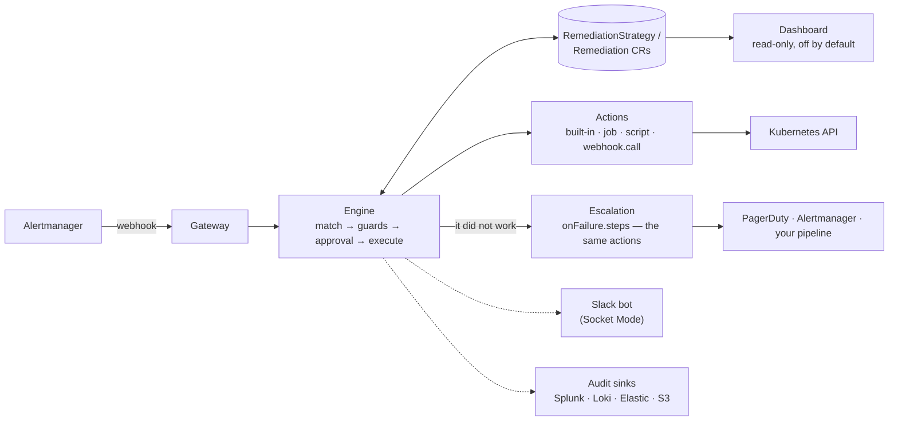

# Architecture

> Living document. The authoritative behavior contracts are the specs in
> [`openspec/`](../openspec/); this document is the map. Status labels:
> **[shipped]** = implemented and tested, **[planned]** = designed, not yet
> built.

## The loop



Everything solid is **shipped**; the dashed integrations are **planned**
follow-up changes.

## Components

| Component | Role | Status |
| --- | --- | --- |
| Gateway | Receives Alertmanager webhooks, authenticates, normalizes grouped alerts into events | shipped |
| Engine | Matches events to strategies, evaluates guards, runs the per-execution state machine, writes audit | shipped |
| Actions | Fourteen across four groups: workloads (`deployment.restart`, `workload.restart`, `pod.delete`, `job.delete`), capacity (`deployment.rollback`, `deployment.scale`, `hpa.scale`), nodes (`node.cordon`, `node.uncordon`, `node.drain`, `pvc.expand`) and escape hatches (`webhook.call`, `job.run`, `script.run`). `ActionPlugin` is later | shipped |
| Metrics | Prometheus counters and histograms on the manager's metrics endpoint | shipped |
| Escalation | `onFailure.steps` — a second plan when a remediation fails for good, made of the same actions, so "escalate" is a `webhook.call` to PagerDuty or a `job.run` into a pipeline | shipped |
| Slack bot | Socket Mode; rich notifications, Approve/Deny buttons, manual commands (`@remedik …`) | planned |
| Dashboard | Read-only web UI served by the operator: overview, dry-run report, one page per execution, strategies | shipped |
| AI diagnosis | BYO-LLM, read-only, optional (see ADR-0003) | planned |

## Execution modes (per strategy)

- `auto` — remediate without asking. The default.
- `approval` — wait for a person; escalate if nobody looks.
- `manual` — never triggered by an alert.

All three work. [How the gate is built, and why it needs no bot](#execution-modes)
is further down; `notify.level` (`none` / `onCompletion` / `verbose`) is the part
still planned.

## The execution state machine

```
(new) --> Pending --> Running --> Succeeded | Simulated
             ^            |
             |            +-----> Failed          (no retries left)
             |                      |
             |                      +--> onFailure.steps, if declared
             |                           (recorded, never changes the state)
             +------------+-----> Pending         (retry, after backoff)
          Running on entry -----> Failed/Interrupted
```

In `approval` mode the record waits before any of that, and nothing is resolved
or planned while it does:

```
(new) --> AwaitingApproval --+-- approved --> Running   (resolved and planned now,
                             |                           against the cluster as
                             |                           it is at this moment)
                             +-- denied ----> Failed/Denied   (no escalation:
                             |                                 somebody looked)
                             +-- deadline --> Failed/ApprovalTimeout
                                                      |
                                                      +--> onFailure.steps
```

`AwaitingApproval` is a state the process can legitimately be found in, exactly
as `Pending` is, so `Running`-means-interrupted below is untouched.

One attempt runs to completion inside a single reconcile, so a Remediation
found in `Running` can only mean the operator died mid-execution. It is
failed as `Interrupted` rather than resumed: resuming a mutating step safely
would need per-action idempotency guarantees that do not exist yet, and
silently repeating an action is the worse outcome.

Waiting for a retry is `Pending`, never `Running` — that keeps the rule
above true, and the operator does not hold a worker while it waits. Retry
delays double from 30s to a 10 minute cap, without jitter: a single-replica
operator has no herd to spread, and predictable timing is easier to explain
at an incident review.

Terminal records are pruned per strategy (200 by default), and the record
that just finished is never a pruning candidate whatever the timestamps
say.

## One instance acts

The operator holds a lease in its own namespace and only the holder
reconciles or accepts alerts. Every other replica keeps listening and answers
`503` with a `Retry-After`.

The reason is the guards. They keep their state in memory — which is why
`internal/guards` has no Kubernetes dependency and its tests are the fastest
here — so two instances would each enforce a cooldown the other cannot see.
The alert storm remedik exists to absorb would be amplified rather than
absorbed. `replicaCount: 2` is therefore failover, never throughput, and it
is safe: more replicas cannot mean more remediation.

Every HTTP server — gateway, dashboard, metrics — declares that it does not
need the lease. That is load-bearing rather than tidy: controller-runtime
starts a runnable that says nothing only once the lease is won, so without it
a standby has no listener at all and refuses the connection. Which replica
*accepts* is the gateway's own decision, made per request, and that is the
only place leadership belongs.

The gateway does not stop listening on a standby. A Service has one set of
endpoints, so a replica with no listener refuses the connection, and
Alertmanager cannot tell "wrong pod" from "remedik is down" — the one thing
a gateway must never be mistaken for. A 503 is a normal outcome: the sender
retries, the Service picks a pod again, and the alert lands a moment later.
It sits beside the rule that the gateway answers 200 to anything it
understood, and both are about being honest with the sender: 200 means "I
have it", 503 means "ask again".

The guards are replayed when the lease is taken, not when the process
starts. A standby that loaded at boot and took over six hours later would be
enforcing six-hour-old cooldowns, which is the mistake leader election
exists to prevent arriving through a side door. An instance that cannot
replay them stops rather than remediating without them.

Readiness is deliberately not leadership. Gating the probe on "would this
instance accept an alert" was tried and reverted: a standby then never
becomes ready, so `helm --wait` and `kubectl rollout status` never finish on
a deployment with more than one replica — the failover this exists to allow
could not be installed with ordinary tooling. A standby is ready because it
is doing its job. The consequence is worth stating: a ready replica is not
proof that alerts are being accepted, so anything that needs to know should
ask the gateway, which is what `hack/e2e.sh` does.

## Execution modes

A strategy chooses how much autonomy it has, per strategy.

| | |
| --- | --- |
| `auto` | remediates without asking |
| `approval` | waits for a person; escalates if nobody looks |
| `manual` | never starts from an alert |

**Approving is a `kubectl patch`, and that is the design rather than a
placeholder:**

```bash
kubectl -n remedik patch remediation drain-safely-x7k2q --type merge \
  -p '{"spec":{"approval":{"decision":"approve","by":"dana"}}}'
```

Approval was scoped with a Slack bot for a long time, which is why it went
unbuilt: the bot is a large piece of work against a service that cannot be
tested from a checkout. But the gate does not need one. A patch is attributable
in the cluster's audit log, expressible from a terminal, a runbook, a GitOps
commit or a bot, and needs nothing outside the cluster — so Slack becomes a
nicer front end for the same gate rather than a prerequisite for having one.

Four properties, each chosen against an obvious alternative:

- **Nothing is resolved or planned while waiting.** A remediation waiting for
  approval must not already have worked out what it would do to a cluster that
  has since moved on, so the plan is produced *after* the decision — against the
  cluster as it is then, not as it was when the alert arrived an hour ago.
- **`AwaitingApproval` is its own state, and not `Running`.** Waiting is a state
  the process can legitimately be found in, exactly as `Pending` is, so
  `Running`-means-interrupted is untouched.
- **Silence escalates.** No decision within `approvalTimeout` and the
  remediation fails as `ApprovalTimeout` and runs `onFailure.steps`. The failure
  mode of a human gate is that nobody looks, and a gate that quietly drops what
  nobody looked at is worse than no gate: it turns an alert into silence. A
  *denial* does not escalate — somebody looked and said no, and telling them
  again is not information.
- **The deadline is absolute and set at creation.** A duration would restart on
  every reconcile, so a remediation would wait for ever as long as anything
  requeued it.

Waiting is not a poll. The controller already watches `Remediation`, so a patch
is a watch event and a decision is acted on in about a second; the requeue exists
only so that a missed event cannot hold a remediation open past its deadline.

`by` is what the patcher claims. remedik cannot authenticate a write without an
admission webhook, so it records the claim and does not present it as verified —
the cluster's audit log is the authority on who issued the patch. Omitting
attribution until it could be trusted would have been worse: it leaves the audit
trail with no answer at all to "who approved this".

Waiting records come first on the dashboard's attention panel, ahead of
everything that already happened, because they are the only entries where
somebody doing something changes the outcome. A queue nobody can see is a queue
nobody empties, and an approval gate that silently accumulates looks like
remediation working.

## The kill switch

One command stops remediation, on every replica, within seconds and with no
restart:

```bash
kubectl -n remedik patch configmap remedik-pause \
  --type merge -p '{"data":{"paused":"true","reason":"network incident"}}'
```

**It does not silence remedik — it forces dry-run everywhere.** That distinction
is the design. Refusing alerts outright would mean the one time an operator most
wants to know what remediation would have done is the moment they stopped it. So
every record still appears, marked `Simulated`, carrying the plan and the reason
given, and unpausing is an informed decision rather than a hopeful one.

Three details, each chosen against an obvious alternative:

- **A ConfigMap, not a chart value.** A value is how you configure a cluster;
  this is how you stop one at three in the morning. The chart creates the
  ConfigMap so the command above works without anybody having to author an
  object during an incident, and marks it `helm.sh/resource-policy: keep` so an
  uninstall does not take a deliberate stop with it.
- **remedik only reads it.** Its RBAC is `get, list, watch` on that one name. A
  switch the tool can flip is not a switch.
- **Every replica watches it**, not only the leader: the gateway answers on all
  of them, and a standby that took over believing remediation was enabled would
  act on the first alert it saw.

A read failure changes nothing and says so. Flipping to paused because the API
server hiccuped would be a self-inflicted outage of remediation; flipping to
running would ignore somebody's deliberate stop. The last known answer does
neither.

The dashboard says `Paused` in its header on every page, and the pause is folded
into the posture the pages render — so a namespace cannot show `Live` while
nothing anywhere will act. That contradiction is the same defect as showing
today's posture beside historical counts, and a test asserts the two agree.

## Retention

Terminal records are reclaimed two ways: a count per strategy, and — when it is
configured — an age.

The count alone was a leak rather than a policy. Pruning ran inside the
terminal status write, so it only ever reclaimed records for the strategy that
had just finished one. A strategy that was disabled, renamed, deleted, or had
merely gone quiet kept everything it had ever made, for ever, and over the life
of a cluster strategies are added and removed — each departure leaving a
permanent deposit nothing would look at again.

So retention is applied by a sweeper on a timer. A timer converges where more
hooks would not: whatever state the cluster reached and however it got there,
the next sweep applies the policy. It runs on the leader only, because it is
the one thing here that deletes without a remediation having happened, and it
deletes at a bounded rate because deleting in bulk makes watch events in bulk.

The part that would be an incident if it were got wrong is the floor. Guard
state is rebuilt from existing records at startup, so a record inside a
strategy's cooldown or `giveUpAfter` window is not history — it is the reason
remedik will refuse to act again. Delete it and, after the next restart,
remedik remediates something it had correctly refused. So nothing newer than
the longest guard window currently configured is ever deleted, whatever the
age says, and the operator logs when that floor is what is in force:
`remedik_records_held_by_guards` counts it, because a retention policy that is
quietly not being applied is worse than one that is refused.

## Giving up

Three guards pace remediation — `cooldown` says not yet, `maxPerHour` says not
this many, `blastRadius` says not safely. None of them ever concludes anything,
so remedik will restart the same Deployment for ever.

`giveUpAfter` concludes. After N remediations of the same target inside a
window, remedik stops and creates a `Remediation` recording that it has, which
runs the strategy's `onFailure.steps`.

Four decisions in it are worth the paragraph each:

- **It counts remediations, not failures.** The case it exists for is
  remediations that *succeed*: the rollout completes, the pods come back ready,
  and twenty minutes later the alert is back. Counting failures would miss it.
- **It is scoped to `(strategy, target)`.** `maxPerHour` is counted across
  every target, so one workload that keeps breaking consumes the whole budget
  and stops a strategy protecting the other thirty-nine. This does not.
- **Giving up leaves a record.** Every other guard refuses into an event and a
  metric — defensible for "not yet", indefensible for "I have stopped helping",
  which would otherwise be the state with the least visibility and the most
  consequence. The record has no steps; its entire content is the escalation.
  It is excluded from every guard, on creation and on replay, because counting
  a decision as an action would extend the window that produced it.
- **A window, not a streak.** remedik never learns that an alert resolved, so
  it cannot observe a streak being broken. Five restarts in two hours means
  restarting is not the fix; five over three months is a Tuesday. The window
  also makes the guard clear itself, where a latch somebody must reset is a
  latch that stays set — the application gets fixed and the tool silently keeps
  not helping.

## Concurrency

Four remediations may execute at once, from `concurrency` in the chart.

It is a blast-radius setting rather than a throughput one, and deliberately a
fixed number rather than a CPU count: how much remedik changes in a cluster at
the same moment should not depend on which node the operator was scheduled on.

It exists because one worker meant one remediation at a time, cluster-wide, for
as long as it took. The values the CRD already permits put that at fifteen
hours in the worst case, and the ordinary case is worse than it sounds because
it is ordinary — a `job.run` that hands an incident to a pipeline and waits for
the verdict, which the cookbook recommends because a pipeline API answers
"queued" rather than "succeeded". Two retries and that is half an hour during
which nothing else in the cluster is remediated, which is precisely backwards
for a tool that exists to absorb a storm.

controller-runtime still reconciles a single object with one worker, so
`Running` continues to mean the process died and the conflict that refuses a
stale verdict is untouched. The steps within one remediation stay strictly
ordered: step two acts on step one's result, and the record is a sequence
somebody reads during an incident.

## Posture

`dryRun` is the default and `namespacePosture` overrides it per namespace,
so one install can act where remediation has been earned and report
everywhere else. That combination is how people actually adopt a tool that
holds write access, and without it a trial that cannot be turned on for one
namespace is a trial that never ends.

Four decisions, each against an obvious alternative:

- **The setting lives in the chart**, not on a `Namespace` and not on a
  strategy. A label on the namespace reads better and is wrong: remedik's
  RBAC is cluster-wide, granted once on the strength of a reviewed set of
  actions, so a namespace label would let anyone with `edit` there promote
  themselves from "reported" to "remediated" using permissions somebody
  else granted. On a strategy is no better — a strategy matches by alert
  labels and spans namespaces, so it cannot express "live here, reporting
  there" without being copied. In the chart, posture and RBAC sit in the
  same file and disagree in a diff somebody reads.
- **The namespace is the target's**, not remedik's. `staging` means the
  workload in staging.
- **The posture is resolved once**, when the record is created, and written
  onto it. The reconciler obeys the record and never re-reads the current
  default, because the two legitimately disagree — that is the feature —
  and re-reading would silently simulate a namespace somebody deliberately
  made live. An in-flight execution therefore keeps the posture it started
  with, exactly as it keeps its steps and its retry budget.
- **A target with no namespace takes the default.** A node, a webhook, a Job
  run outside any workload. Guessing would be worse, and the default ships
  as dry-run.

The cost of this feature is one specific misreading: somebody sees
`dryRun: true` and believes nothing acts. No naming fixes that, so it is
made hard to miss instead — the chart prints the overrides after every
install, the operator warns at startup that the default does not describe
the cluster, `remedik_namespace_posture{namespace,posture}` makes it
queryable, the dashboard's badge reads `Mixed`, and every record carries the
posture it ran under.

To stop everything, scale the deployment to zero or disable the strategy.
Both are instant; changing `dryRun` never was, because it needs a rollout
either way.

## Escalation

`onFailure.steps` is a second plan, run once the remediation has failed and
the retries are spent. It is how "and if that does not work, tell somebody"
is written down, and it is deliberately made of the same actions as
everything else: escalating is a `webhook.call` to PagerDuty, or a `job.run`
that hands the incident to a pipeline. There is no notification subsystem,
so there is nothing to configure separately, nothing that bypasses RBAC, and
nothing that escapes the audit trail.

The escalation worth reaching for first is back into Alertmanager, with
`webhook.call` and `format: alertmanager`. It raises `RemediationFailed` with
every label the triggering alert carried, which means the routing tree that
delivered the symptom to a team delivers the failure to the same team — and
the silences, the inhibition rules and the on-call schedule all apply, because
they were already there. Paging PagerDuty directly works and is sometimes
right, but it is a second copy of that configuration with its own credentials
to keep in step.

`format` is a closed set of named body shapes rather than a template. A
strategy is read during an incident by somebody who did not write it, and a Go
template inside one is a second language to debug at the worst moment; it also
means the action can state what it sends, which is the question asked before
granting anything webhook access.

Five properties, each chosen against an obvious alternative:

- **Every channel is tried.** A failed escalation step does not skip the ones
  after it, which is the opposite of the rule for a remediation plan and
  deliberate: the steps there are a sequence where each acts on the last one's
  result, and the steps here are alternative ways to reach a person. Stopping
  at the first failure made a configured fallback a single point of failure,
  and an invisible one — every channel succeeds when the path is tested. The
  escalation is `Succeeded` when one channel got through, because the question
  the record answers is whether anybody was told; `onFailure.mode:
  firstSuccess` is for an ordered fallback that should not page twice.

- **It cannot change the outcome.** A remediation that escalated is still a
  remediation that did not work. A record turning green because somebody was
  paged would be the most misleading thing this project could do.
- **It runs once the retries are spent, not per attempt.** Paging on the
  first failure of three pages for something about to fix itself, and a page
  that is usually unnecessary is a page people learn to ignore.
- **It runs during a dry run**, and it is the only thing in remedik that
  does. A trial is exactly when an operator wants to see the escalation path
  work; the steps are told `remedik_dry_run="true"` so nobody is paged for
  an incident that did not happen. Put nothing mutating in an escalation.
- **It is not retried.** If the page fails during an incident, looping on it
  helps nobody. `status.escalation` records that it failed, the dashboard
  says so plainly, and `remedik_escalations_total{outcome="Failed"}` is its
  own alertable signal — a remediation failed and nobody was told.

The steps receive the alert's labels plus remedik's own —
`remedik_remediation`, `remedik_strategy`, `remedik_target`,
`remedik_reason`, `remedik_message`, `remedik_attempts`, `remedik_dry_run` —
so a webhook body or a Job's environment explains the incident with no
templating. remedik's keys overwrite any alert label of the same name: an
escalation that can be lied to by whoever writes the alerting rules is worse
than no escalation.

**Know what a webhook's success means.** A pipeline API answers 200 "run
queued", not "run succeeded", so a bare `webhook.call` records success the
moment the pipeline *starts*. Where the outcome matters, use `job.run` with
an image that triggers and then polls: the step waits for the Job, and the
exit code and last log lines land in the record.

Executions are serialised: the controller reconciles one at a time. During
an alert storm that means remediations queue rather than running at once,
which is the safer default for something holding write access to a cluster.
Concurrency becomes a setting when there is a reason to raise it.

## Guards

Declarative, per strategy, and all opt-in — zero means unenforced, because
stopping a strategy is `enabled: false`, never an unset field.

| Guard | Asks | Scope |
| --- | --- | --- |
| `cooldown` | how recently did this run here? | strategy + target |
| `maxPerHour` | how often has this run? | strategy, trailing hour |
| `blastRadius` | how broken is this workload already? | the workload behind the target |

The first two are about time and need nothing from the cluster.
`blastRadius` is about state: `minAvailable` refuses while the workload has
that many available replicas or fewer, and `maxUnavailablePercent` refuses
while that share of it is already unavailable. It is what bounds the actions
that *remove* capacity rather than replacing it, and it is a second opinion
beside a PodDisruptionBudget rather than a substitute — the PDB was written
by whoever owns the workload, this by whoever decided an automated system
may act on it unattended.

Two properties of `blastRadius` are worth stating plainly:

- **It fails closed.** If the workload cannot be read — no permission, an API
  error — the guard refuses. A guard that permits an execution when it could
  not evaluate its own condition is not a guard, it is a comment. The
  refusal names the missing permission on the strategy's events.
- **"Nothing to measure" is not the same as "could not measure".** A node has
  no replica count and an action that touches nothing has no workload, so
  the guard allows. Conflating the two would make failing closed either
  useless or paralysing.

It reads the cluster, so it is a permission like any other:
`guards.blastRadius.enabled=true` grants `get` on the three workload kinds,
on pods, and on replicasets to walk a pod to its Deployment.

Two switches stop remediation without uninstalling anything: `enabled:
false` on a single strategy, and `dryRun: true` globally, which keeps
matching, guards and audit running while nothing is executed. Dry-run is the
install default, so the first thing a cluster gets is a report rather than
an action.

Guard state (recent completions, hourly counts) is held in memory and
rebuilt from the `Remediation` resources at startup. A guard that evaporated
on restart would be worse than no guard, because it is one people rely on.

## The action contract

Every remediation verb implements the same four-part contract, and the split
is what makes dry-run a guarantee rather than a convention:

| Part | Cluster access | Called when |
| --- | --- | --- |
| `Resolve` | none | always — works out the object from the alert's labels |
| `Plan` | read-only | always; **the only mutating-adjacent call dry-run makes** |
| `Execute` | writes | never in dry-run |
| `Verify` | read-only | after `Execute`, never in dry-run. Optional |

`Verify` is why a step can say whether the remediation *worked* rather than
whether the API call was accepted. `deployment.restart` waits for the
rollout to reach the observed generation with every replica updated,
available and ready, and a rollout that does not finish inside the step's
`verifyTimeout` (60s by default, 10m maximum) fails the step — the retry
budget then applies as it would to any other failure. Actions with nothing
to verify, such as a cordon, simply do not implement it: a check that always
passes is worse than no check, because it looks like one.

Each call reports a `Result` rather than a string, so what ends up on the
record is:

- the **summary** — one line naming the object and what happened to it;
- the **kubectl equivalent** — the command a human would have typed, recorded
  and never executed, so the change is reviewable by someone who has never
  read this source;
- **structured outputs** — replicas before and after, an exit code, a
  revision. Machine-readable, so nobody has to parse prose.

### Where the explanation appears

Three places, deliberately, because people look in three places:

- **On the object.** Events are published on the workload being remediated —
  `Remediating` before the step, `Remediated` or `RemediationFailed` after —
  each naming the Remediation record and the strategy responsible. Someone
  running `kubectl describe deployment payments/api` after an unexplained
  restart gets an answer without needing to know remedik exists. Targets are
  addressed through the manager's RESTMapper, so every action added later
  gets this with no table to update; an event that cannot be addressed is
  logged and skipped, never a reason to fail a remediation that worked.
- **On the strategy.** Guard rejections, which answer "why did nothing
  happen?".
- **On the `Remediation` record**, and therefore on the dashboard: the full
  per-step trail.

## The action catalogue

Each action is a permission. The chart grants an action's rules only when it
is enabled, and lists them with their reasoning in
[`charts/remedik/action-rbac.yaml`](../charts/remedik/action-rbac.yaml) —
one table, rather than a trail of conditionals through a template, because
its reviewability is what invariant 4 rests on. The same values also decide
which actions the operator registers, so a strategy naming a disabled action
is reported as unusable when it is applied rather than failing during the
incident it was written for.

| Action | Does | Enabled by default | Notes |
| --- | --- | --- | --- |
| `deployment.restart` | Rolling restart of a Deployment | yes | Patches the pod template; never deletes pods |
| `workload.restart` | The same, for Deployments, StatefulSets and DaemonSets | no | Takes its kind from the alert's label |
| `pod.delete` | Evicts one pod | no | Eviction API, so a PodDisruptionBudget can refuse. Refuses a pod with no controller owner |
| `job.delete` | Deletes a Job and its pods | no | So the owning CronJob makes a clean run |
| `deployment.rollback` | Puts the previous revision back | no | Refuses a workload Argo CD or Flux manages: they would revert it |
| `deployment.scale` | Sets or increases replicas | no | Refuses a Deployment an HPA owns; a relative increase must state a ceiling |
| `hpa.scale` | Raises an autoscaler's `maxReplicas` | no | Never lowers one |
| `webhook.call` | POSTs the incident to a URL | no | Credential from a Secret in remedik's namespace only; non-2xx fails the step |
| `job.run` | Runs an image as a Job | no | In remedik's namespace, under a ServiceAccount the step names — never remedik's |
| `script.run` | `job.run`, script from a ConfigMap | no | ConfigMap read from remedik's namespace only |
| `node.cordon` / `node.uncordon` | Stop and resume scheduling on a node | no | The safest pair here: nothing moves, one command undoes it |
| `node.drain` | Cordon, then evict every eligible pod | no | **The widest permission remedik holds.** A partial drain is a failure |
| `pvc.expand` | Grow a PersistentVolumeClaim | no | Refuses where the StorageClass forbids expansion; one-way |

**Why eviction rather than deletion.** Deleting a pod ignores
PodDisruptionBudgets entirely; the Eviction API is the only call that checks
them, and returns 429 when the removal would breach the budget. remedik
records that as a refusal naming the budget, and the pod stays up. The
permission it holds says the same thing: `create` on `pods/eviction`, never
`delete` on `pods`.

**The escape hatches.** `webhook.call`, `job.run` and `script.run` exist
because four built-in verbs will never cover what people need at 3am, and
"remedik cannot do X" is a reason not to install it at all. They are also
the widest trust surface in the project, so each is bounded deliberately:

- Jobs are created in **remedik's own namespace only**. A namespace
  parameter would mean holding `create` on jobs cluster-wide permanently, so
  that a strategy can occasionally start one somewhere. A Job that must act
  elsewhere does so through its ServiceAccount, which is where that
  authority belongs.
- The Job's **ServiceAccount is named by the step**, defaults to `default`
  — which can do nothing — and may never be remedik's own, which is refused
  with a message saying why. Forgetting produces a Job that cannot act,
  rather than one that can do everything the operator can.
- The **command is a JSON array**. A string would need quoting rules, and
  quoting rules invented for a YAML field are how a remediation ends up
  running something nobody wrote.
- Secrets and ConfigMaps are read from **remedik's own namespace only**.
  Reading them from a namespace an alert names would let a label decide
  which credential is used, or let anyone with write access anywhere have
  code executed by the operator.
- The alert's labels reach the container **prefixed**, so a label called
  `PATH` cannot replace the container's.

**What remedik will not do.** Published deliberately, because a list of
refusals says more about an automation than another verb does:

- Delete a node or resize a node group. That is a cloud API with a different
  trust model; cluster-api's MachineHealthCheck and the medik8s operators do
  it properly.
- Delete a pod nothing owns. Nothing recreates it, so that is deletion, not
  remediation.
- Patch resource requests or limits. It restarts every pod in the workload
  and hides the problem it was called for.
- Raise a ResourceQuota. A quota is a decision somebody made on purpose.
- Act on control-plane alerts. Automation against a sick API server is how
  one bad night becomes a bad quarter.

## Extensibility ladder

1. Compose YAML from built-in actions (the cookbook). **[shipped]**
2. `action: script` — a ConfigMap script run in a sandboxed Job.
3. `action: job` — any container image as a step.
4. `action: webhook.call` — trigger external pipelines (Azure DevOps,
   GitHub Actions, AWX…).
5. `ActionPlugin` CRD — package image + parameter schema + required RBAC as
   a new reusable verb. Contract: params as JSON on stdin, result as exit
   code + JSON on stdout.

## The dashboard

Off by default. When enabled it serves five pages on its own port and
answers the questions that are painful through kubectl: *what would this
have done* during a dry-run trial, *why did nothing happen* during an
incident, and *is anything wrong right now*.

The pages split by the question they answer, which is the shape the first
version got wrong by putting all of them on one:

| Page | Question |
| --- | --- |
| `/` | Is anything wrong right now? Posture, what needs attention, activity over the last day, where remediation is happening |
| `/remediations` | What happened, and to what? The full list, with the filters |
| `/remediations/{name}` | What did this one do, step by step |
| `/namespaces` | Where is this going badly? One row per namespace, ordered by what needs attention |
| `/strategies` | What could happen, and under what guards |

The overview is panels. Each is a claim with a link to its evidence, and
each is one struct, one builder and one template block, which is why
`/namespaces` was an addition rather than a rearrangement. The "needs
attention" panel orders by how much silence each entry represents: a failed
escalation, which means nobody was told, outranks a failure somebody has
already seen.

`/namespaces` applies that same ordering across namespaces. Two things about
it are decisions rather than details.

The first is scale. The worst dozen namespaces get a card; everything else is
a compact table that still carries its failure counts, and the page says how
many it held back. Paging was considered and rejected: page two of a list
ordered by severity is by construction the part that does not need attention.
The bound exists because the unbounded version put 81 of 150 namespaces above
the fold on a seeded cluster, at which point the heading was meaningless.

The second is honesty about time. The posture chip is today's configuration
and the counts are history, and they can legitimately disagree — a record
carries the posture it ran under, and a later config change cannot rewrite
it. So a namespace marked `Reporting` may hold executions that changed
something, and the row says so rather than letting the chip contradict the
numbers beside it.

It is also careful about one more thing: it is not a health page. remedik knows the remediations it
ran, not whether the workloads in a namespace are well, and a page implying
otherwise would be the dashboard being authoritative about something it
never measured. So every column is remedik's own record — executions, how
they ended, how many failures nobody was told about — and every row states
its posture, because a namespace where remedik only reports and one where it
acts are not comparable, and two identical failure counts under different
postures mean opposite things.

Read-only is structural rather than promised. The handler is constructed
from a `client.Reader`, so it holds no method that writes; a method
allowlist answers anything but GET and HEAD with 405 before routing, so a
page added later cannot opt out. Writes belong to kubectl and, later, to the
Slack bot — which is where an identity model exists to record *who* asked.

It adds no RBAC: the pages list exactly what the reconciler already watches,
served from the manager's cache, so rendering one costs no API call. `make
helm-lint` renders the chart with the dashboard on and off and fails if the
Role or ClusterRole differ by a byte.

Pages are `html/template` rendered server-side and embedded with `go:embed`,
including the stylesheet — no npm, no bundler, no second release artifact,
and no request to anything outside the cluster, so an air-gapped cluster
renders the same page. About forty lines of dependency-free JavaScript
re-fetch the page every ten seconds and swap its `<main>`, so watching an
incident does not throw away the reader's scroll position; without
JavaScript everything still renders.

Filtering is a query string — `?namespace=payments&state=Failed` — which
falls out of the read-only rule rather than being a shortcut: a filter that
needed a write could not exist behind a GET-only allowlist. The consequence
is the useful part, that a narrowed view is a URL somebody can send during
an incident.

**Every filter control is a link**, and that is the second attempt. The
first was a `<select>` and an Apply button, which holds state between the
choice and the submission — and the ten-second refresh replaces the content
region, so that state was destroyed on average within five seconds, faster
than anybody reaches the button. Moving the controls out of the refreshed
region fixed it and left a design whose correctness depended on where the
markup sat. A link has nothing to lose: one click filters, no JavaScript is
involved at any point, and clicking the value already in force removes it,
so the same control narrows and widens.

Each control carries the count its choice would yield, computed without that
dimension's own clause, so switching between namespaces does not mean trying
each one. The counts above the table follow the filter and the choices do
not: numbers that disagreed with the rows beneath them would be worse than
no filter, and a control whose options shrink as you use it is one you can
get stuck in.

**The control follows the cardinality.** Links are the best control for a
handful and the worst for a hundred and fifty, which is a wall nobody scans.
Above a threshold the dimension becomes a `<select>` carrying every value
and its count, beside links for the busiest few. A select is not a
compromise there: browsers give it keyboard type-ahead, which is exactly the
"find my namespace among 150" interaction, for no JavaScript. Its form sends
the other clauses back as hidden fields, so choosing a namespace does not
silently clear the state somebody already chose.

**The list pages**, because "200 shown, 9,800 not drawn" is a truncation with
an apology rather than a list of what happened. Pages are links, so they
compose with the filters and can be sent to somebody. A page beyond the end
is clamped, not refused — history is pruned, so a bookmarked page 40 may
have become nothing.

**Only the live region is replaced by the refresh.** The list marks its rows
and counts; its controls sit outside. That is what made it safe to offer a
select at all — the same state whose destruction made the filter look broken
twice. The cost is that the options do not gain a namespace first seen since
the page loaded, until any navigation, which is the cheaper side of the
trade by a wide margin.

**What it costs, measured.** On 150 namespaces, 40 strategies and 10,000
records, held in `internal/dashboard/scale_test.go` so the number is checked
rather than claimed:

| | before | after |
| --- | --- | --- |
| Building the list page | 49.7 ms | **1.2 ms** |
| Building the overview | 0.96 ms | **0.7 ms** |

The 49.7 ms was not slowness, it was shape: each filter option counted
itself with its own pass over every record, so the cost was options ×
records and grew as a product. Counting each dimension in one pass gives
identical numbers. The version that was wrong read as obviously correct; the
benchmark is what made it obviously wrong, which is why it is checked in.

**The page reloads itself when the operator changes.** Only the content
region is swapped by a refresh, so `<head>`, the stylesheet and this script
are whatever the tab loaded — for ever, in a tab open across an upgrade,
whose data would keep updating through last week's markup. The refresh
compares the asset fingerprint it fetched with the running one and reloads
when they differ. That defect is why two correct filter fixes were reported
as "still does not work": they were correct, and the tab reading them
predated both.

There is no cluster filter, and the omission is deliberate. remedik watches
the cluster it runs in, so a control offering a choice of clusters would be
offering a choice of one; filtering across clusters needs the hub/spoke
work. What exists instead is `clusterName`, a label in the header and the
browser tab, because three port-forwarded dashboards otherwise produce three
identical-looking tabs.

The chart exposes it as a ClusterIP Service and creates no Ingress:
publishing alert labels and workload names is the cluster owner's decision.
The documented way in is `kubectl port-forward`. Authentication is one
token, presented either as a bearer header or as the password in the
browser's own prompt — a browser cannot be told to send a bearer header, and
an authenticated dashboard nobody can open is how you end up with an
unauthenticated one.

## Observability

remedik is monitored by the same Prometheus that feeds it. The metrics
endpoint carries two kinds of series, and the difference matters when
reading a graph:

- **Counters** say what remedik has *done*: alerts received, unmatched and
  truncated, ingest errors, unauthenticated attempts, guard rejections by
  guard, remediations started and finished by outcome, and a duration
  histogram.
- **Gauges** say what remedik currently *is*: `remedik_build_info`,
  `remedik_dry_run`, `remedik_strategies` by enabled state and
  `remedik_remediation_records` by state. Without them, a flat remediation
  rate is unreadable — dry-run, no enabled strategies and a genuinely quiet
  week all look identical.

The gauges that depend on cluster state are produced by a Prometheus
collector reading the manager's cache when a scrape arrives, rather than a
copy kept up to date on a timer. It cannot go stale, and it costs no API
call: a scrape that reached the API server would turn Prometheus's polling
interval into load on the control plane. A read that fails reports *no*
series rather than zero — zero enabled strategies means remediation cannot
happen, and emitting that because a read failed would turn a monitoring
failure into a false incident.

Three optional chart resources, all off by default:

| Value | Creates | Why it is off by default |
| --- | --- | --- |
| `serviceMonitor.enabled` | `ServiceMonitor` | Not every cluster runs the Prometheus Operator |
| `prometheusRule.enabled` | `PrometheusRule`, six alerts about remedik itself | Rules are opinions about somebody else's cluster |
| `grafanaDashboard.enabled` | ConfigMap the Grafana sidecar loads | The sidecar's label differs per install |

`serviceMonitor.additionalLabels` is load-bearing rather than cosmetic: the
Prometheus Operator selects ServiceMonitors by label, and one created
without the selector's label is created, ignored, and hard to notice.
kube-prometheus-stack defaults to `release: <its release name>`.

The alerts are about the operator and never about the workloads it
remediates — those already have alerts, and those alerts are remedik's
input. They cover: not being scraped, ingest failing, alerts arriving that
never match a strategy, most remediations failing, deliveries truncated
before arrival, and repeated unauthenticated attempts.

## Topologies

- **Standalone (default)** — one agent per cluster; no shared credentials.
- **Hub/spoke (planned, opt-in)** — one install on a management cluster;
  target clusters are only *registered* (`ManagedCluster` CR + a bootstrap
  manifest creating a minimal ServiceAccount). Per-cluster remediation
  switch: `enabled | dryRun | off`. Trade-off documented: the hub holds
  (minimal, rotatable) credentials for spokes.

## Security posture

See [SECURITY.md](../SECURITY.md): signed images + SBOM + SLSA, distroless
non-root runtime, NetworkPolicies, feature-scoped RBAC, automatic secret
redaction, threat model maintained with the specs.
