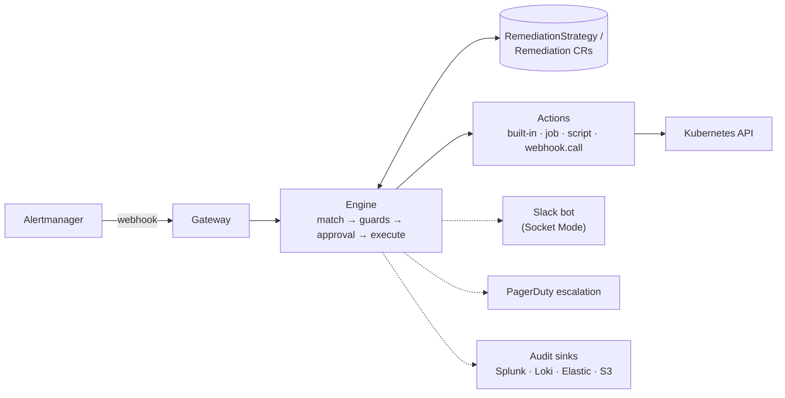

# Architecture

> Living document. The authoritative behavior contracts are the specs in
> [`openspec/`](../openspec/); this document is the map. Status labels:
> **[specified]** = contract exists in an OpenSpec change,
> **[planned]** = designed, not yet specified.

## The loop

Everything solid ships first (**[specified]** in `add-mvp-core`); dashed
integrations are **[planned]** follow-up changes.

## Components

| Component | Role | Status |
| --- | --- | --- |
| Gateway | Receives Alertmanager webhooks, authenticates, normalizes grouped alerts into events | specified |
| Engine | Matches events to strategies, evaluates guards, runs the per-execution state machine, writes audit | specified |
| Actions | Built-in verbs (`deployment.restart` first), later `job`, `script`, `webhook.call`, `ActionPlugin` | specified (first action) |
| Slack bot | Socket Mode; rich notifications, Approve/Deny buttons, manual commands (`@remedik …`) | planned |
| Escalation | PagerDuty / on-call channel when execution fails or approval times out | planned |
| GUI | Read-only dashboard served by the operator: timeline, dry-run reports, strategies, clusters | planned |
| AI diagnosis | BYO-LLM, read-only, optional (see ADR-0003) | planned |

## Execution modes (per strategy)

- `auto` — remediate without asking; notify per `notify.level`
  (`none` / `onCompletion` / `verbose`); everything lands in the audit trail.
- `approval` — post a Slack card with Approve/Deny; no answer within the
  timeout → escalate. Default for destructive actions.
- `manual` — never triggered by alerts; runs only via explicit command.

`auto` is the only mode in `add-mvp-core`; `approval`/`manual` arrive with
the Slack change.

## Guards

Declarative, per strategy: `cooldown`, `maxPerHour`, and (planned)
`blastRadius` (e.g. max % of nodes affected per hour). A global kill switch
and per-strategy `enabled` flag can stop everything instantly. Dry-run is
the install default: two weeks of "what I would have done" reports before
the first real action.

## Extensibility ladder

1. Compose YAML from built-in actions (the cookbook).
2. `action: script` — a ConfigMap script run in a sandboxed Job.
3. `action: job` — any container image as a step.
4. `action: webhook.call` — trigger external pipelines (Azure DevOps,
   GitHub Actions, AWX…).
5. `ActionPlugin` CRD — package image + parameter schema + required RBAC as
   a new reusable verb. Contract: params as JSON on stdin, result as exit
   code + JSON on stdout.

## Topologies

- **Standalone (default)** — one agent per cluster; no shared credentials.
- **Hub/spoke (planned, opt-in)** — one install on a management cluster;
  target clusters are only *registered* (`ManagedCluster` CR + a bootstrap
  manifest creating a minimal ServiceAccount). Per-cluster remediation
  switch: `enabled | dryRun | off`. Trade-off documented: the hub holds
  (minimal, rotatable) credentials for spokes.

## Security posture

See [SECURITY.md](../SECURITY.md): signed images + SBOM + SLSA, distroless
non-root runtime, NetworkPolicies, feature-scoped RBAC, automatic secret
redaction, threat model maintained with the specs.
