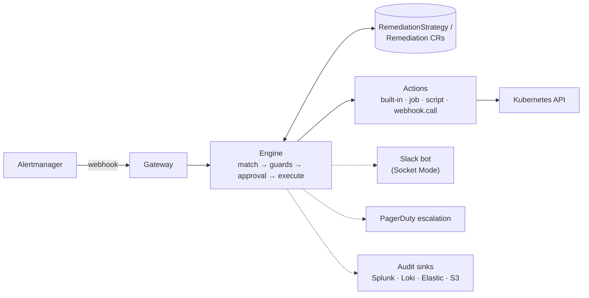

# Architecture

> Living document. The authoritative behavior contracts are the specs in
> [`openspec/`](../openspec/); this document is the map. Status labels:
> **[shipped]** = implemented and tested, **[planned]** = designed, not yet
> built.

## The loop



Everything solid is **shipped**; the dashed integrations are **planned**
follow-up changes.

## Components

| Component | Role | Status |
| --- | --- | --- |
| Gateway | Receives Alertmanager webhooks, authenticates, normalizes grouped alerts into events | shipped |
| Engine | Matches events to strategies, evaluates guards, runs the per-execution state machine, writes audit | shipped |
| Actions | `deployment.restart`; later `job`, `script`, `webhook.call`, `ActionPlugin` | shipped (first action) |
| Metrics | Prometheus counters and histograms on the manager's metrics endpoint | shipped |
| Slack bot | Socket Mode; rich notifications, Approve/Deny buttons, manual commands (`@remedik …`) | planned |
| Escalation | PagerDuty / on-call channel when execution fails or approval times out | planned |
| GUI | Read-only dashboard served by the operator: timeline, dry-run reports, strategies, clusters | planned |
| AI diagnosis | BYO-LLM, read-only, optional (see ADR-0003) | planned |

## Execution modes (per strategy)

- `auto` — remediate without asking; notify per `notify.level`
  (`none` / `onCompletion` / `verbose`); everything lands in the audit trail.
- `approval` — post a Slack card with Approve/Deny; no answer within the
  timeout → escalate. Default for destructive actions.
- `manual` — never triggered by alerts; runs only via explicit command.

`auto` is the only mode implemented today. The enum rejects the others on
purpose: a manifest written for a newer remedik fails loudly on an older
one, rather than quietly remediating without the approval it asked for.

## The execution state machine

```
(new) --> Pending --> Running --> Succeeded | Simulated
             ^            |
             |            +-----> Failed          (no retries left)
             +------------+-----> Pending         (retry, after backoff)
          Running on entry -----> Failed/Interrupted
```

One attempt runs to completion inside a single reconcile, so a Remediation
found in `Running` can only mean the operator died mid-execution. It is
failed as `Interrupted` rather than resumed: resuming a mutating step safely
would need per-action idempotency guarantees that do not exist yet, and
silently repeating an action is the worse outcome.

Waiting for a retry is `Pending`, never `Running` — that keeps the rule
above true, and the operator does not hold a worker while it waits. Retry
delays double from 30s to a 10 minute cap, without jitter: a single-replica
operator has no herd to spread, and predictable timing is easier to explain
at an incident review.

Terminal records are pruned per strategy (200 by default), and the record
that just finished is never a pruning candidate whatever the timestamps
say.

Executions are serialised: the controller reconciles one at a time. During
an alert storm that means remediations queue rather than running at once,
which is the safer default for something holding write access to a cluster.
Concurrency becomes a setting when there is a reason to raise it.

## Guards

Declarative, per strategy: `cooldown` (per strategy and target) and
`maxPerHour` (per strategy, trailing hour). Both are opt-in — zero means
unenforced — because stopping a strategy is `enabled: false`, never an unset
field. `blastRadius` is planned.

Two switches stop remediation without uninstalling anything: `enabled:
false` on a single strategy, and `dryRun: true` globally, which keeps
matching, guards and audit running while nothing is executed. Dry-run is the
install default, so the first thing a cluster gets is a report rather than
an action.

Guard state (recent completions, hourly counts) is held in memory and
rebuilt from the `Remediation` resources at startup. A guard that evaporated
on restart would be worse than no guard, because it is one people rely on.

## Extensibility ladder

1. Compose YAML from built-in actions (the cookbook). **[shipped]**
2. `action: script` — a ConfigMap script run in a sandboxed Job.
3. `action: job` — any container image as a step.
4. `action: webhook.call` — trigger external pipelines (Azure DevOps,
   GitHub Actions, AWX…).
5. `ActionPlugin` CRD — package image + parameter schema + required RBAC as
   a new reusable verb. Contract: params as JSON on stdin, result as exit
   code + JSON on stdout.

## Topologies

- **Standalone (default)** — one agent per cluster; no shared credentials.
- **Hub/spoke (planned, opt-in)** — one install on a management cluster;
  target clusters are only *registered* (`ManagedCluster` CR + a bootstrap
  manifest creating a minimal ServiceAccount). Per-cluster remediation
  switch: `enabled | dryRun | off`. Trade-off documented: the hub holds
  (minimal, rotatable) credentials for spokes.

## Security posture

See [SECURITY.md](../SECURITY.md): signed images + SBOM + SLSA, distroless
non-root runtime, NetworkPolicies, feature-scoped RBAC, automatic secret
redaction, threat model maintained with the specs.
