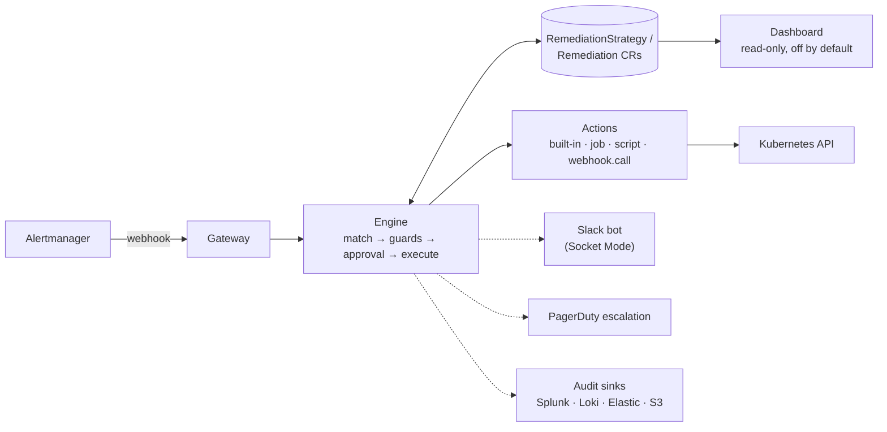

# Architecture

> Living document. The authoritative behavior contracts are the specs in
> [`openspec/`](../openspec/); this document is the map. Status labels:
> **[shipped]** = implemented and tested, **[planned]** = designed, not yet
> built.

## The loop



Everything solid is **shipped**; the dashed integrations are **planned**
follow-up changes.

## Components

| Component | Role | Status |
| --- | --- | --- |
| Gateway | Receives Alertmanager webhooks, authenticates, normalizes grouped alerts into events | shipped |
| Engine | Matches events to strategies, evaluates guards, runs the per-execution state machine, writes audit | shipped |
| Actions | `deployment.restart`, `workload.restart`, `pod.delete`, `job.delete`; later scaling, rollback, node actions, `job`/`script`/`webhook.call`, `ActionPlugin` | shipped |
| Metrics | Prometheus counters and histograms on the manager's metrics endpoint | shipped |
| Slack bot | Socket Mode; rich notifications, Approve/Deny buttons, manual commands (`@remedik …`) | planned |
| Escalation | PagerDuty / on-call channel when execution fails or approval times out | planned |
| Dashboard | Read-only web UI served by the operator: overview, dry-run report, one page per execution, strategies | shipped |
| AI diagnosis | BYO-LLM, read-only, optional (see ADR-0003) | planned |

## Execution modes (per strategy)

- `auto` — remediate without asking; notify per `notify.level`
  (`none` / `onCompletion` / `verbose`); everything lands in the audit trail.
- `approval` — post a Slack card with Approve/Deny; no answer within the
  timeout → escalate. Default for destructive actions.
- `manual` — never triggered by alerts; runs only via explicit command.

`auto` is the only mode implemented today. The enum rejects the others on
purpose: a manifest written for a newer remedik fails loudly on an older
one, rather than quietly remediating without the approval it asked for.

## The execution state machine

```
(new) --> Pending --> Running --> Succeeded | Simulated
             ^            |
             |            +-----> Failed          (no retries left)
             |                      |
             |                      +--> onFailure.steps, if declared
             |                           (recorded, never changes the state)
             +------------+-----> Pending         (retry, after backoff)
          Running on entry -----> Failed/Interrupted
```

One attempt runs to completion inside a single reconcile, so a Remediation
found in `Running` can only mean the operator died mid-execution. It is
failed as `Interrupted` rather than resumed: resuming a mutating step safely
would need per-action idempotency guarantees that do not exist yet, and
silently repeating an action is the worse outcome.

Waiting for a retry is `Pending`, never `Running` — that keeps the rule
above true, and the operator does not hold a worker while it waits. Retry
delays double from 30s to a 10 minute cap, without jitter: a single-replica
operator has no herd to spread, and predictable timing is easier to explain
at an incident review.

Terminal records are pruned per strategy (200 by default), and the record
that just finished is never a pruning candidate whatever the timestamps
say.

## Escalation

`onFailure.steps` is a second plan, run once the remediation has failed and
the retries are spent. It is how "and if that does not work, tell somebody"
is written down, and it is deliberately made of the same actions as
everything else: escalating is a `webhook.call` to PagerDuty, or a `job.run`
that hands the incident to a pipeline. There is no notification subsystem,
so there is nothing to configure separately, nothing that bypasses RBAC, and
nothing that escapes the audit trail.

Four properties, each chosen against an obvious alternative:

- **It cannot change the outcome.** A remediation that escalated is still a
  remediation that did not work. A record turning green because somebody was
  paged would be the most misleading thing this project could do.
- **It runs once the retries are spent, not per attempt.** Paging on the
  first failure of three pages for something about to fix itself, and a page
  that is usually unnecessary is a page people learn to ignore.
- **It runs during a dry run**, and it is the only thing in remedik that
  does. A trial is exactly when an operator wants to see the escalation path
  work; the steps are told `remedik_dry_run="true"` so nobody is paged for
  an incident that did not happen. Put nothing mutating in an escalation.
- **It is not retried.** If the page fails during an incident, looping on it
  helps nobody. `status.escalation` records that it failed, the dashboard
  says so plainly, and `remedik_escalations_total{outcome="Failed"}` is its
  own alertable signal — a remediation failed and nobody was told.

The steps receive the alert's labels plus remedik's own —
`remedik_remediation`, `remedik_strategy`, `remedik_target`,
`remedik_reason`, `remedik_message`, `remedik_attempts`, `remedik_dry_run` —
so a webhook body or a Job's environment explains the incident with no
templating. remedik's keys overwrite any alert label of the same name: an
escalation that can be lied to by whoever writes the alerting rules is worse
than no escalation.

**Know what a webhook's success means.** A pipeline API answers 200 "run
queued", not "run succeeded", so a bare `webhook.call` records success the
moment the pipeline *starts*. Where the outcome matters, use `job.run` with
an image that triggers and then polls: the step waits for the Job, and the
exit code and last log lines land in the record.

Executions are serialised: the controller reconciles one at a time. During
an alert storm that means remediations queue rather than running at once,
which is the safer default for something holding write access to a cluster.
Concurrency becomes a setting when there is a reason to raise it.

## Guards

Declarative, per strategy, and all opt-in — zero means unenforced, because
stopping a strategy is `enabled: false`, never an unset field.

| Guard | Asks | Scope |
| --- | --- | --- |
| `cooldown` | how recently did this run here? | strategy + target |
| `maxPerHour` | how often has this run? | strategy, trailing hour |
| `blastRadius` | how broken is this workload already? | the workload behind the target |

The first two are about time and need nothing from the cluster.
`blastRadius` is about state: `minAvailable` refuses while the workload has
that many available replicas or fewer, and `maxUnavailablePercent` refuses
while that share of it is already unavailable. It is what bounds the actions
that *remove* capacity rather than replacing it, and it is a second opinion
beside a PodDisruptionBudget rather than a substitute — the PDB was written
by whoever owns the workload, this by whoever decided an automated system
may act on it unattended.

Two properties of `blastRadius` are worth stating plainly:

- **It fails closed.** If the workload cannot be read — no permission, an API
  error — the guard refuses. A guard that permits an execution when it could
  not evaluate its own condition is not a guard, it is a comment. The
  refusal names the missing permission on the strategy's events.
- **"Nothing to measure" is not the same as "could not measure".** A node has
  no replica count and an action that touches nothing has no workload, so
  the guard allows. Conflating the two would make failing closed either
  useless or paralysing.

It reads the cluster, so it is a permission like any other:
`guards.blastRadius.enabled=true` grants `get` on the three workload kinds,
on pods, and on replicasets to walk a pod to its Deployment.

Two switches stop remediation without uninstalling anything: `enabled:
false` on a single strategy, and `dryRun: true` globally, which keeps
matching, guards and audit running while nothing is executed. Dry-run is the
install default, so the first thing a cluster gets is a report rather than
an action.

Guard state (recent completions, hourly counts) is held in memory and
rebuilt from the `Remediation` resources at startup. A guard that evaporated
on restart would be worse than no guard, because it is one people rely on.

## The action contract

Every remediation verb implements the same four-part contract, and the split
is what makes dry-run a guarantee rather than a convention:

| Part | Cluster access | Called when |
| --- | --- | --- |
| `Resolve` | none | always — works out the object from the alert's labels |
| `Plan` | read-only | always; **the only mutating-adjacent call dry-run makes** |
| `Execute` | writes | never in dry-run |
| `Verify` | read-only | after `Execute`, never in dry-run. Optional |

`Verify` is why a step can say whether the remediation *worked* rather than
whether the API call was accepted. `deployment.restart` waits for the
rollout to reach the observed generation with every replica updated,
available and ready, and a rollout that does not finish inside the step's
`verifyTimeout` (60s by default, 10m maximum) fails the step — the retry
budget then applies as it would to any other failure. Actions with nothing
to verify, such as a cordon, simply do not implement it: a check that always
passes is worse than no check, because it looks like one.

Each call reports a `Result` rather than a string, so what ends up on the
record is:

- the **summary** — one line naming the object and what happened to it;
- the **kubectl equivalent** — the command a human would have typed, recorded
  and never executed, so the change is reviewable by someone who has never
  read this source;
- **structured outputs** — replicas before and after, an exit code, a
  revision. Machine-readable, so nobody has to parse prose.

### Where the explanation appears

Three places, deliberately, because people look in three places:

- **On the object.** Events are published on the workload being remediated —
  `Remediating` before the step, `Remediated` or `RemediationFailed` after —
  each naming the Remediation record and the strategy responsible. Someone
  running `kubectl describe deployment payments/api` after an unexplained
  restart gets an answer without needing to know remedik exists. Targets are
  addressed through the manager's RESTMapper, so every action added later
  gets this with no table to update; an event that cannot be addressed is
  logged and skipped, never a reason to fail a remediation that worked.
- **On the strategy.** Guard rejections, which answer "why did nothing
  happen?".
- **On the `Remediation` record**, and therefore on the dashboard: the full
  per-step trail.

## The action catalogue

Each action is a permission. The chart grants an action's rules only when it
is enabled, and lists them with their reasoning in
[`charts/remedik/action-rbac.yaml`](../charts/remedik/action-rbac.yaml) —
one table, rather than a trail of conditionals through a template, because
its reviewability is what invariant 4 rests on. The same values also decide
which actions the operator registers, so a strategy naming a disabled action
is reported as unusable when it is applied rather than failing during the
incident it was written for.

| Action | Does | Enabled by default | Notes |
| --- | --- | --- | --- |
| `deployment.restart` | Rolling restart of a Deployment | yes | Patches the pod template; never deletes pods |
| `workload.restart` | The same, for Deployments, StatefulSets and DaemonSets | no | Takes its kind from the alert's label |
| `pod.delete` | Evicts one pod | no | Eviction API, so a PodDisruptionBudget can refuse. Refuses a pod with no controller owner |
| `job.delete` | Deletes a Job and its pods | no | So the owning CronJob makes a clean run |
| `deployment.rollback` | Puts the previous revision back | no | Refuses a workload Argo CD or Flux manages: they would revert it |
| `deployment.scale` | Sets or increases replicas | no | Refuses a Deployment an HPA owns; a relative increase must state a ceiling |
| `hpa.scale` | Raises an autoscaler's `maxReplicas` | no | Never lowers one |
| `webhook.call` | POSTs the incident to a URL | no | Credential from a Secret in remedik's namespace only; non-2xx fails the step |
| `job.run` | Runs an image as a Job | no | In remedik's namespace, under a ServiceAccount the step names — never remedik's |
| `script.run` | `job.run`, script from a ConfigMap | no | ConfigMap read from remedik's namespace only |
| `node.cordon` / `node.uncordon` | Stop and resume scheduling on a node | no | The safest pair here: nothing moves, one command undoes it |
| `node.drain` | Cordon, then evict every eligible pod | no | **The widest permission remedik holds.** A partial drain is a failure |
| `pvc.expand` | Grow a PersistentVolumeClaim | no | Refuses where the StorageClass forbids expansion; one-way |

**Why eviction rather than deletion.** Deleting a pod ignores
PodDisruptionBudgets entirely; the Eviction API is the only call that checks
them, and returns 429 when the removal would breach the budget. remedik
records that as a refusal naming the budget, and the pod stays up. The
permission it holds says the same thing: `create` on `pods/eviction`, never
`delete` on `pods`.

**The escape hatches.** `webhook.call`, `job.run` and `script.run` exist
because four built-in verbs will never cover what people need at 3am, and
"remedik cannot do X" is a reason not to install it at all. They are also
the widest trust surface in the project, so each is bounded deliberately:

- Jobs are created in **remedik's own namespace only**. A namespace
  parameter would mean holding `create` on jobs cluster-wide permanently, so
  that a strategy can occasionally start one somewhere. A Job that must act
  elsewhere does so through its ServiceAccount, which is where that
  authority belongs.
- The Job's **ServiceAccount is named by the step**, defaults to `default`
  — which can do nothing — and may never be remedik's own, which is refused
  with a message saying why. Forgetting produces a Job that cannot act,
  rather than one that can do everything the operator can.
- The **command is a JSON array**. A string would need quoting rules, and
  quoting rules invented for a YAML field are how a remediation ends up
  running something nobody wrote.
- Secrets and ConfigMaps are read from **remedik's own namespace only**.
  Reading them from a namespace an alert names would let a label decide
  which credential is used, or let anyone with write access anywhere have
  code executed by the operator.
- The alert's labels reach the container **prefixed**, so a label called
  `PATH` cannot replace the container's.

**What remedik will not do.** Published deliberately, because a list of
refusals says more about an automation than another verb does:

- Delete a node or resize a node group. That is a cloud API with a different
  trust model; cluster-api's MachineHealthCheck and the medik8s operators do
  it properly.
- Delete a pod nothing owns. Nothing recreates it, so that is deletion, not
  remediation.
- Patch resource requests or limits. It restarts every pod in the workload
  and hides the problem it was called for.
- Raise a ResourceQuota. A quota is a decision somebody made on purpose.
- Act on control-plane alerts. Automation against a sick API server is how
  one bad night becomes a bad quarter.

## Extensibility ladder

1. Compose YAML from built-in actions (the cookbook). **[shipped]**
2. `action: script` — a ConfigMap script run in a sandboxed Job.
3. `action: job` — any container image as a step.
4. `action: webhook.call` — trigger external pipelines (Azure DevOps,
   GitHub Actions, AWX…).
5. `ActionPlugin` CRD — package image + parameter schema + required RBAC as
   a new reusable verb. Contract: params as JSON on stdin, result as exit
   code + JSON on stdout.

## The dashboard

Off by default. When enabled it serves three pages on its own port — an
overview, one page per `Remediation`, and the strategy list — and answers
the two questions that are painful through kubectl: *what would this have
done* during a dry-run trial, and *why did nothing happen* during an
incident.

Read-only is structural rather than promised. The handler is constructed
from a `client.Reader`, so it holds no method that writes; a method
allowlist answers anything but GET and HEAD with 405 before routing, so a
page added later cannot opt out. Writes belong to kubectl and, later, to the
Slack bot — which is where an identity model exists to record *who* asked.

It adds no RBAC: the pages list exactly what the reconciler already watches,
served from the manager's cache, so rendering one costs no API call. `make
helm-lint` renders the chart with the dashboard on and off and fails if the
Role or ClusterRole differ by a byte.

Pages are `html/template` rendered server-side and embedded with `go:embed`,
including the stylesheet — no npm, no bundler, no second release artifact,
and no request to anything outside the cluster, so an air-gapped cluster
renders the same page. About forty lines of dependency-free JavaScript
re-fetch the page every ten seconds and swap its `<main>`, so watching an
incident does not throw away the reader's scroll position; without
JavaScript everything still renders.

The chart exposes it as a ClusterIP Service and creates no Ingress:
publishing alert labels and workload names is the cluster owner's decision.
The documented way in is `kubectl port-forward`. Authentication is one
token, presented either as a bearer header or as the password in the
browser's own prompt — a browser cannot be told to send a bearer header, and
an authenticated dashboard nobody can open is how you end up with an
unauthenticated one.

## Observability

remedik is monitored by the same Prometheus that feeds it. The metrics
endpoint carries two kinds of series, and the difference matters when
reading a graph:

- **Counters** say what remedik has *done*: alerts received, unmatched and
  truncated, ingest errors, unauthenticated attempts, guard rejections by
  guard, remediations started and finished by outcome, and a duration
  histogram.
- **Gauges** say what remedik currently *is*: `remedik_build_info`,
  `remedik_dry_run`, `remedik_strategies` by enabled state and
  `remedik_remediation_records` by state. Without them, a flat remediation
  rate is unreadable — dry-run, no enabled strategies and a genuinely quiet
  week all look identical.

The gauges that depend on cluster state are produced by a Prometheus
collector reading the manager's cache when a scrape arrives, rather than a
copy kept up to date on a timer. It cannot go stale, and it costs no API
call: a scrape that reached the API server would turn Prometheus's polling
interval into load on the control plane. A read that fails reports *no*
series rather than zero — zero enabled strategies means remediation cannot
happen, and emitting that because a read failed would turn a monitoring
failure into a false incident.

Three optional chart resources, all off by default:

| Value | Creates | Why it is off by default |
| --- | --- | --- |
| `serviceMonitor.enabled` | `ServiceMonitor` | Not every cluster runs the Prometheus Operator |
| `prometheusRule.enabled` | `PrometheusRule`, six alerts about remedik itself | Rules are opinions about somebody else's cluster |
| `grafanaDashboard.enabled` | ConfigMap the Grafana sidecar loads | The sidecar's label differs per install |

`serviceMonitor.additionalLabels` is load-bearing rather than cosmetic: the
Prometheus Operator selects ServiceMonitors by label, and one created
without the selector's label is created, ignored, and hard to notice.
kube-prometheus-stack defaults to `release: <its release name>`.

The alerts are about the operator and never about the workloads it
remediates — those already have alerts, and those alerts are remedik's
input. They cover: not being scraped, ingest failing, alerts arriving that
never match a strategy, most remediations failing, deliveries truncated
before arrival, and repeated unauthenticated attempts.

## Topologies

- **Standalone (default)** — one agent per cluster; no shared credentials.
- **Hub/spoke (planned, opt-in)** — one install on a management cluster;
  target clusters are only *registered* (`ManagedCluster` CR + a bootstrap
  manifest creating a minimal ServiceAccount). Per-cluster remediation
  switch: `enabled | dryRun | off`. Trade-off documented: the hub holds
  (minimal, rotatable) credentials for spokes.

## Security posture

See [SECURITY.md](../SECURITY.md): signed images + SBOM + SLSA, distroless
non-root runtime, NetworkPolicies, feature-scoped RBAC, automatic secret
redaction, threat model maintained with the specs.
